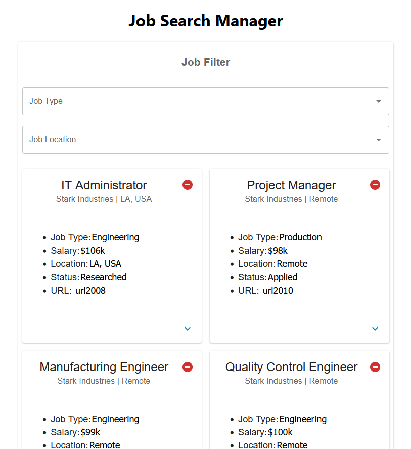

# Job Search Manager
Introducing the Job Search Manager, a cutting-edge web application built using React JS. This app is designed to streamline the job search process for professionals and job seekers alike, providing a user-friendly interface and a wealth of features to help users find their ideal job.

One of the key features of this app is its utilization of Material-UI design principles. This allows for a sleek and modern look and feel, while also ensuring a consistent user experience across all devices.

## Features
* Reads data from TSV file, which user uploads
* Utilizing Chart.js allows for easy creation of visually appealing and informative charts to analyze job search data
* Save and delete entries
* Filter data by job location and job type

## Video Demo
https://youtu.be/y2OJl7cszyY

## Photos
Web App Photo Example 1

Web App Photo Example 2

Web App Photo Example 3

Web App Photo Example 4

Web App Photo Example 5

## How to use
```
yarn add

yarn start
```
